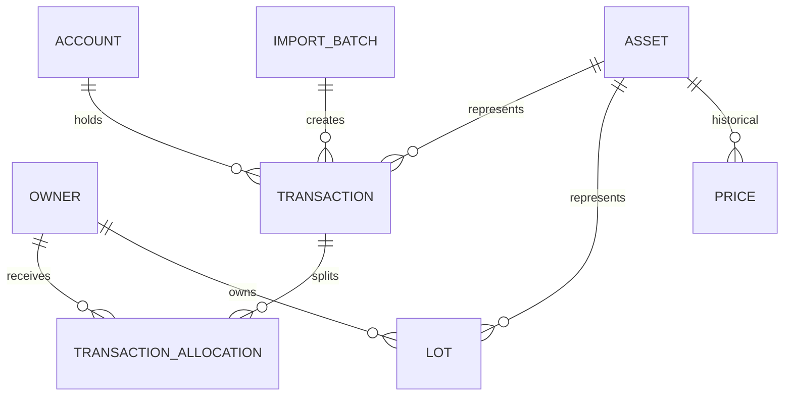

# LedgerAlpha - Data Model Notes

This document describes how the relational database schema underpins the ledger-first architecture of LedgerAlpha.

---

## 1. Relational Entities & Purpose

The database is built on **SQLite** using **Prisma ORM**. Below is the logical breakdown of the key tables:

### A. Owners & Accounts
- `Owner`: Represents a family member (Omar, Mom, Dad). Has a `slug` for URL routing and tracks their allocation units.
- `Account`: Represents the brokerage endpoint (e.g. "Shared Robinhood Account").

### B. Core Ledger Transactions
- `Transaction`: Records every event affecting the portfolio. Types include `BUY`, `SELL`, `DIVIDEND`, `DEPOSIT`, `WITHDRAWAL`, `FEE`, `SPLIT`, `TRANSFER_IN`, `TRANSFER_OUT`.
- `TransactionAllocation`: Maps a transaction to its owners.
  - *Under the Unitized Pool Model*:
    - For `DEPOSIT` and `WITHDRAWAL` transactions, the allocation represents the owner who added or removed the cash, and their percentage is $1.0$ ($100\%$).
    - For asset trades (`BUY`, `SELL`, `DIVIDEND`, `FEE`), the allocations represent the split of ownership *at the moment of the transaction*. These allocations are computed programmatically from the current outstanding units and saved to the database to freeze the historical ownership split.

### C. Market & Benchmark Data
- `Asset`: Tracks the stock tickers, ETFs, cryptocurrencies, and cash equivalents.
- `Price`: Stores end-of-day close prices for assets. Used to compute current portfolio value and historical lot valuations.
- `BenchmarkSnapshot`: Stores end-of-day values of benchmarks (SPY, QQQ, BTC, ETH). Used to compute benchmark returns for decision grading.

### D. FIFO Lot Accounting
- `Lot`: Stores open position cohorts. When a `BUY` transaction occurs, a lot is created. When a `SELL` occurs, `remainingQuantity` is reduced FIFO-style, and realized gains are added.

### E. Decision Scores
- `DecisionScore`: Stores performance reports for each lot vs a benchmark. Contains details like `actualReturnPct`, `benchmarkReturnPct`, `excessReturnPct`, and the letter `grade`.

---

## 2. Schema Diagram

---

## 3. SQLite Limitations & Type Handling
- SQLite does not have a native `Decimal` type. Prisma emulates `Decimal` by storing values as numeric floats or strings, and maps them to decimal classes in JavaScript/TypeScript.
- SQLite does not support native `enums`. Prisma represents them as strings in the SQLite table with check constraints, mapping them to native TypeScript enums on the client side.
